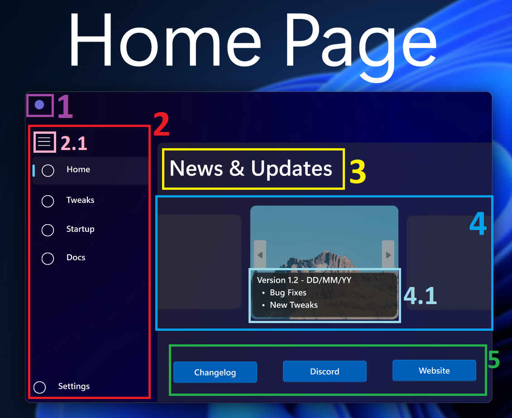
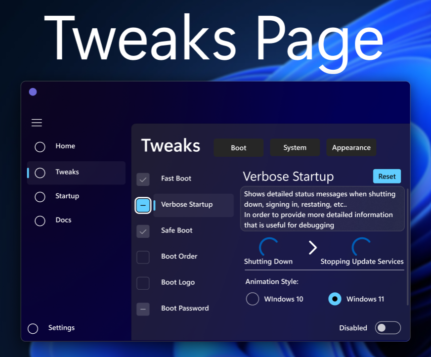
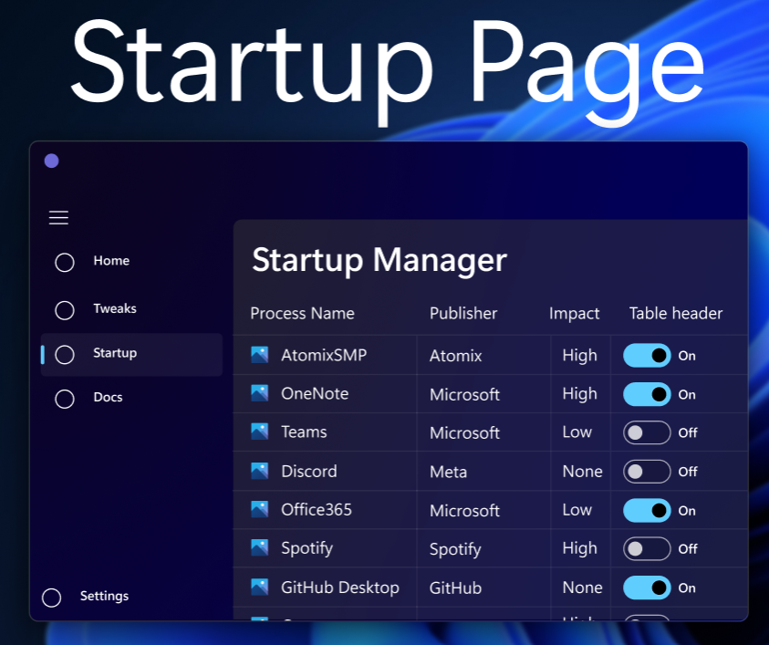
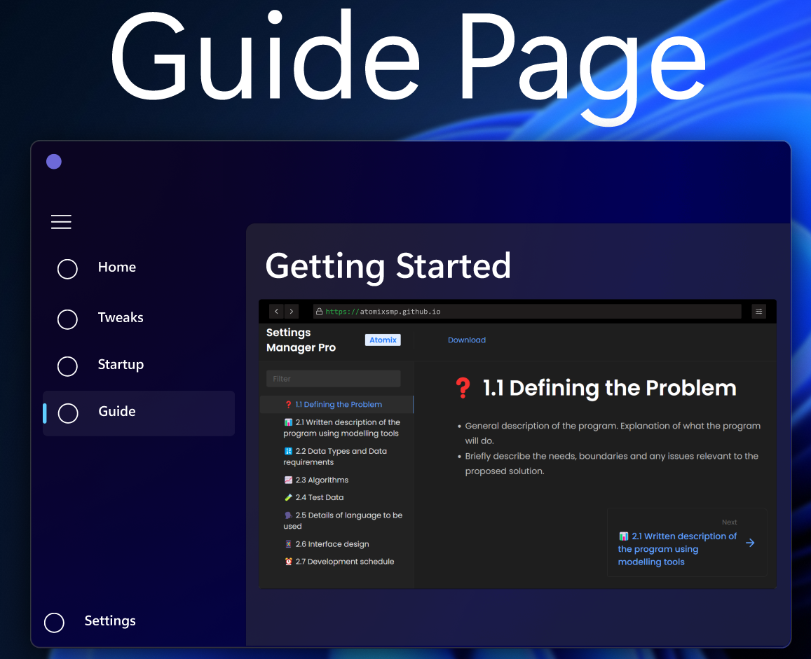

# 📱 2.6 Interface design



<figure><figcaption></figcaption></figure>


**RAW UN-Annotated version**


* 1 / Purple
  * Application Logo + Title Bar.
* 2 / Red
  * Simple Elegant Navigation Menu allowing for seamless transition between pages.
  * Inspired by the Windows 11 Task Manager NavMenu Design.
* 2.1 / Rose
  * Button to Collapse/Expand the Navigation Menu providing more control over screen usage.
* 3 / Yellow
  * Page Title using Windows 11 Font.
* 4 / Light Blue
  * Revolving carousel of cards with images and buttons.&#x20;
* 4.1 / Light Turquoise&#x20;
  * Information Fly out containing Update Notes/Announcements + Version Number & Date.
* 5 / Green
  * Buttons/Links to external resources including Detailed changelog, Community Support, 1st party resources through official website.



<figure><figcaption></figcaption></figure>



<figure><figcaption></figcaption></figure>



<figure><figcaption></figcaption></figure>


